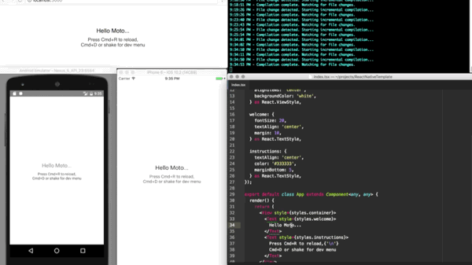

# react-native-ts-template
Template for cross platform application. iOS, Android, web, electron. Written in Typescript, React Native, Redux

#### Install all dependencies
  - `npm install`

#### Typescript Compilation
- Use typescripts command line tool `tsc` to compile code on save
  - `tsc --watch`

#### Web Servers
- Use Webpack's dev server to compile ES2015, bundle dependencies, and serve output files
  - `npm run web`

#### React Native Server
- React Native runs it's own dev server which compiles es2015 to it's output for ios and android
  - `npm start`

#### iOS
- Run the following command to start up an ios simulator, and install the app
  - `npm run ios`

#### Android
- Manually open a Android simulator or device with 6.0 Marshmallow
  - `npm run android`
   - NOTE: this command alone will not start up a virtual device for you. It will error out if one is not already up, or there is no device connected.

## Roadmap
- Electron packaging
- Windows UWP packaging
- Redux
- Basic routing
- Common component demos
- Simplify build process (currently have to run `tsc --watch` separate, maybe it can be moved into webpack dev server, which could feed into folder for react native server)
